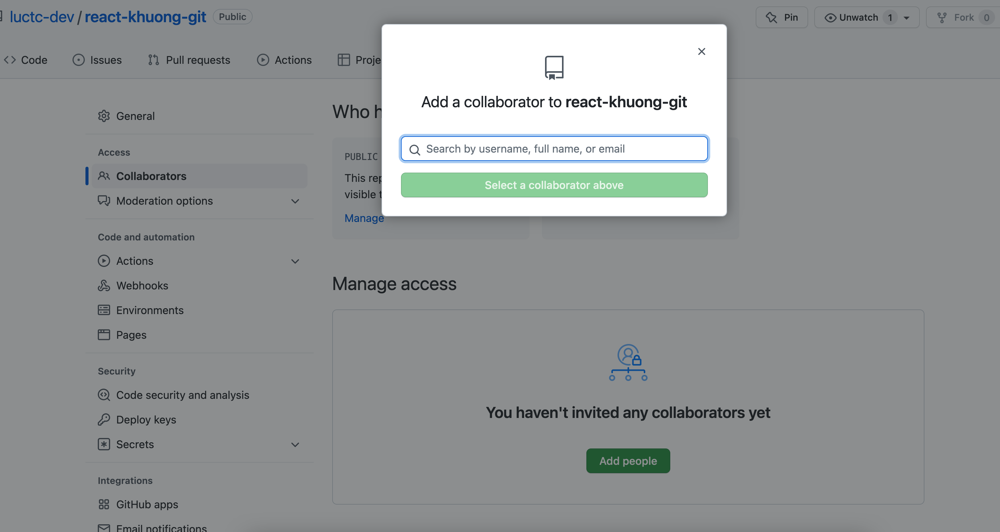
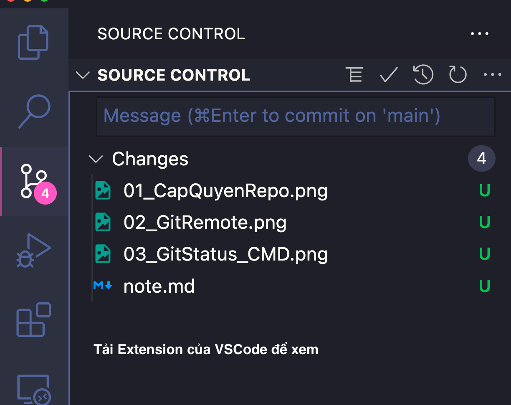

1. Tạo Repo (Tuỳ Project. Ai có quyền mới được tạo)
  - Mình vào một công ty -> Repo đã có sẵn rồi
  - Chờ cấp quyền từ Team Leader
  

2. Một số câu lệnh đơn giản

  - `git clone https://xxx/yyy.git`
  - Ví dụ: 
  - `https://github.com/luctc-dev/react-khuong-git.git`

3. Nhớ check xem có file ẩn `.git` hay không? Nếu có là hợp lệ

4. Kiểm tra xem repo hiện tại link tới URL nào?
  - Gõ lệnh: `git remote -v`
  

  - Để ý từ `origin` chỉ là cái tên đặt cho link remote này

5. Một số lưu ý:
  - Nhánh đang đứng là nhánh nào?
  - Nếu là repo mới thì phải tạo nhánh
  - Thông thường một git sẽ có một `nhánh` - `branch` gốc
  - `branch` gốc tức là một nhánh chính chứa toàn bộ code chứa các tính năng đã được hiện thực xong. Chỉ có người Team Lead mới có quyền thay đổi nhánh này
  - Đa phần tất cả Team Member còn lại khi sửa code phải luôn luôn tạo một `branch` mới để làm việc riêng.
  - Vì sao: Tránh đụng độ code với người. Một Repo sẽ có nhiều người làm việc cùng một lúc.

6. Câu lệnh `git status`:
  - Xem trạng thái của Git có file nào thay đổi `changes` hay không?
  - Có 2 cách để xem: Gõ lệnh hoặc Dùng Extension của VSCode

  
  

7. Câu lệnh add: `git add ????`
  - Câu lệnh bắt đầu đưa những file đã thay đổi để chuẩn bị lên Git Online
  - Ví dụ: Đưa File note.md sẵn sàng để commit
  - `git add note.md`
  - Chỉ có một file sẽ được đưa lên Git mà thôi. Có thể check lại bằng `git status` hoặc `VSCode Extension`
  
  

8. Làm sao để add toàn bộ files?????: `git add .`
  - Add hết tất cả các file trong folder hiện tại.
  - Chạy thử và gõ lệnh `git status` để xem kết quả
  - Nếu muốn gỡ những file vừa add xong. Dùng VSCode để chọn unstaged quay về như cũ
  
  
9. Push code
  - Bước 1: `git add .`
  - Bước 2: `git commit -m "Message mô tả công việc"`
    Cam kết sự thay vừa rồi vào một commit. Có thể check bằng `git log` hoặc VSCode trong tab Commit
  - Bước 3: `git push`
    - Nhánh đã tồn tại: `git push origin main`
    - Nhánh chưa tồn tại: `git push -u origin main`
    